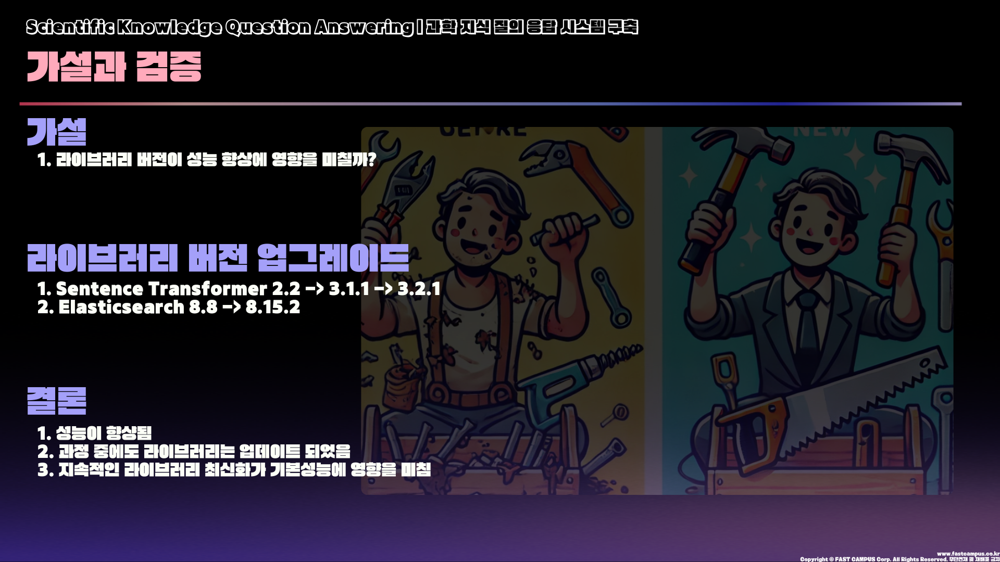
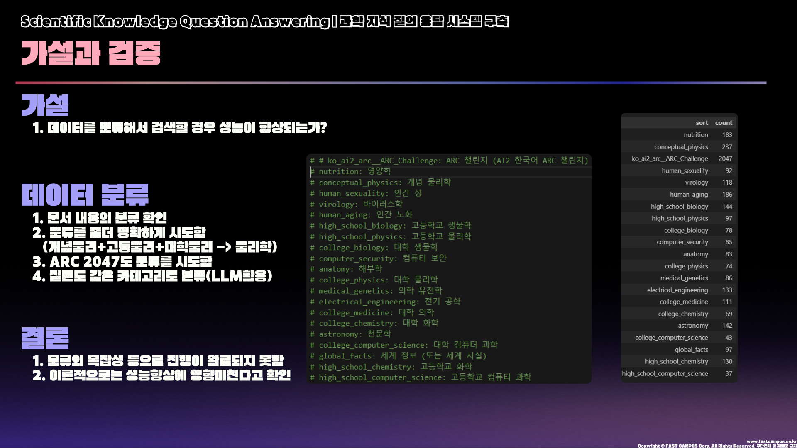
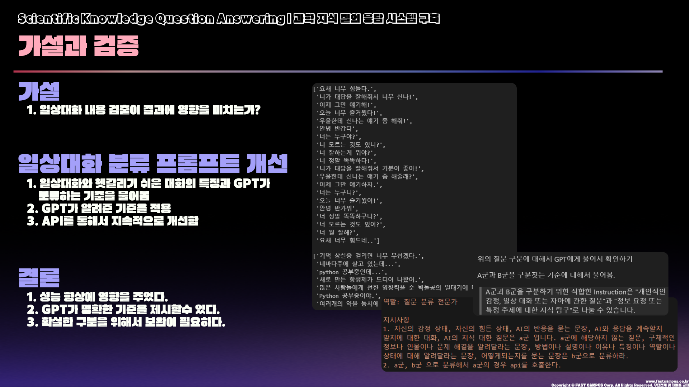
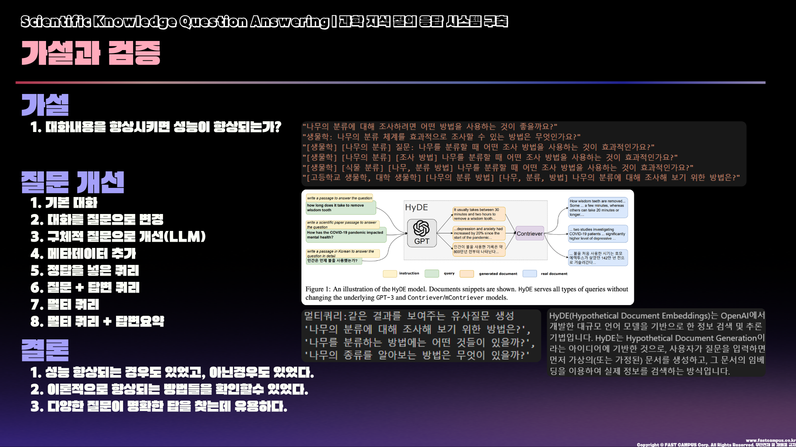
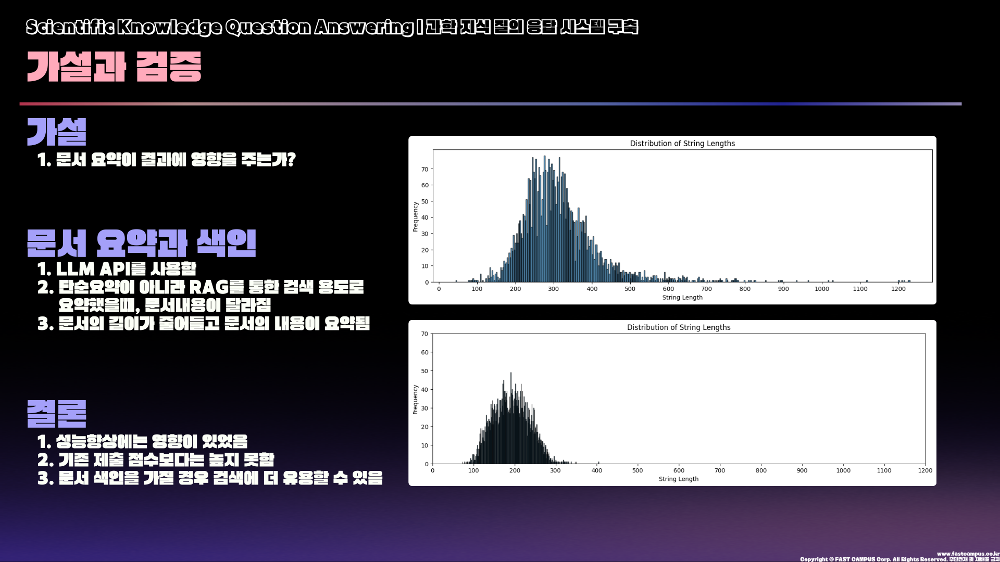
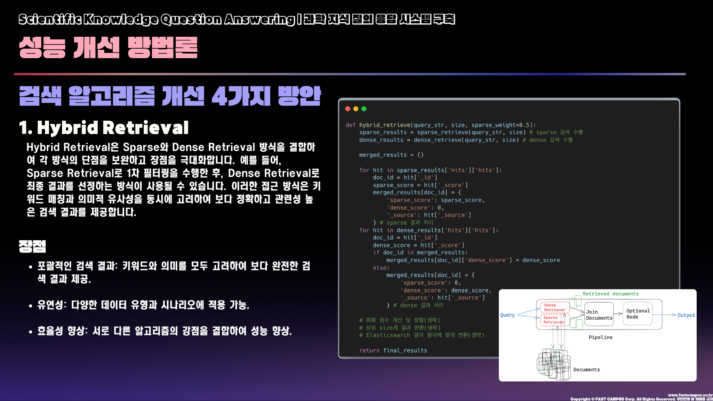
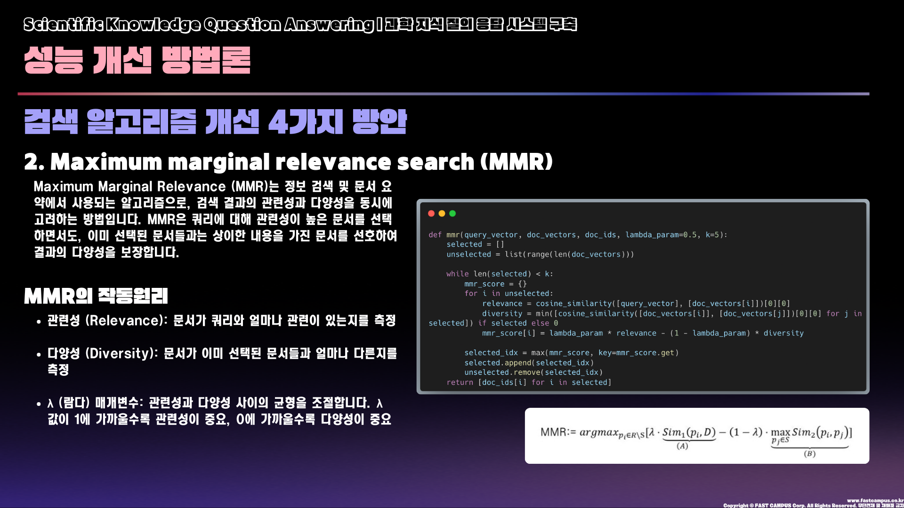
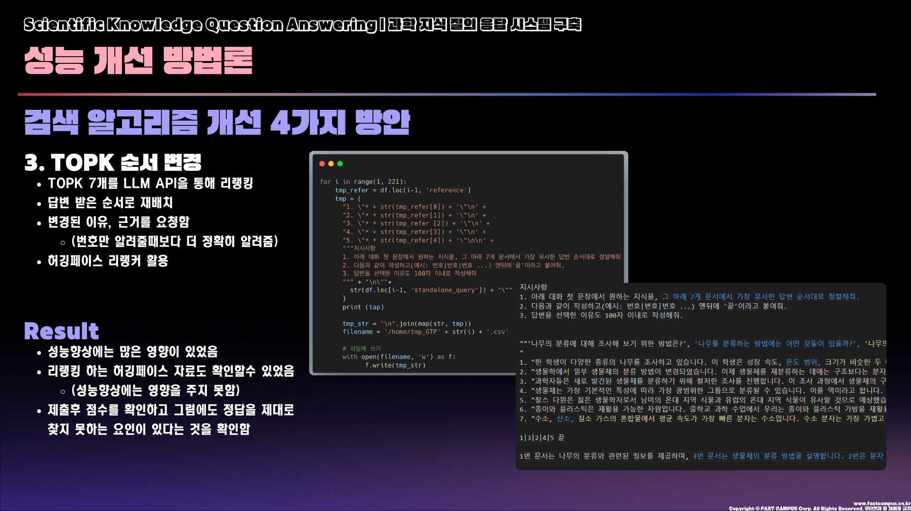
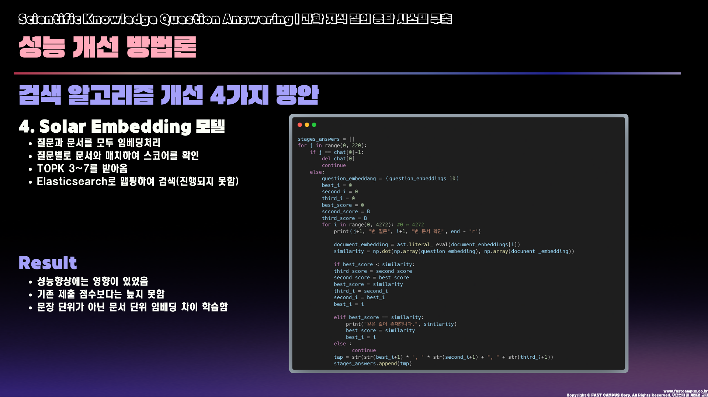
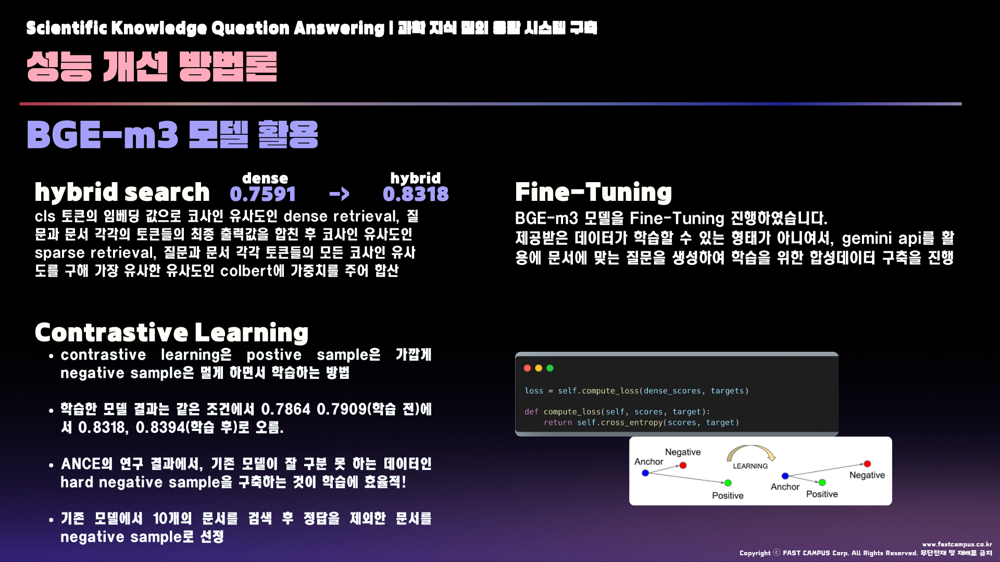

# Scientific Knowledge Question Answering | 과학 지식 질의 응답 시스템 구축
## Team

|  |  | |
| :----------------------------: | :----------------------------: | :----------------------------: |
|            팀장          |         팀원      |          팀원     |
| [성명기](https://github.com/SUNGMYEONGGI)  | [임동건](https://github.com/LimDG1981) | [유정수](https://github.com/Dream-Forge-Studios) |

## 0. Overview

### Environment

-   AMD Ryzen Threadripper 3960X 24-Core Processor
-   NVIDIA GeForce RTX 3090
-   CUDA Version 12.2

### Requirements

- pandas==2.1.4
- numpy==1.23.5
- tqdm==4.66.1
- sentence_transformers==2.2.2
- elasticsearch==8.8.0
- openai==1.7.2
- transformers[torch]==4.35.2

## 1. Competiton Info

### Overview

LLM의 등장 이후 여러 산업 분야에서 지식을 다루는 업무들이 점점 고도화되고 있습니다.

특히 정보를 찾기 위해 검색엔진의 입력창에 키워드를 입력하고 결과를 확인하고 원하는 정보가 없으면 다른 키워드로 다시 검색하기를 반복하는 번거로운 과정을 이제 더이상 자주 할 필요가 없어졌습니다.

이제 LLM한테 물어보면 질문의 의도까지 파악해서 필요한 내용만 잘 정리해서 알려 줍니다.


그렇지만 LLM이 가진 근본적인 한계도 있습니다.

먼저, 정보라는 것은 의미나 가치가 시간에 따라 계속 변하기 때문에 모델이 이를 실시간으로 학습하기 힘들고 이 때문에 아래 예시처럼 knowledge cutoff 가 자연스럽게 발생합니다.


그리고 LLM이 알려주는 지식이 항상 사실에 기반한 것이 아닌 경우가 종종 있습니다. 특히 특정 도메인이나 문제 영역은 매우 심각한 거짓 정보들을 생성해 내곤 합니다. 아래 예시에서 추천하는 맛집들은 모두 실재하지 않는 장소들입니다.


이러한 환각 현상은 메타인지를 학습하지 않은 LLM의 근본적인 한계라 볼 수 있습니다.

모델은 학습 과정에서 정보를 압축해서 저장하기 때문에 정보의 손실이 발생할 수밖에 없고, 이 때문에 특정 입력 조건에 대해서는 사실 여부보다는 지식를 표현하는 국소적인 패턴이 더 큰 영향을 주면서 답변이 생성될 수 있기 때문입니다.

이러한 문제를 극복하기 위해서는 RAG(Retrieval Augmented Generation) 기술이 필수입니다.

RAG는 질문에 적합한 레퍼런스 추출을 위해 검색엔진을 활용하고 답변 생성을 위해 LLM(Large Language Model)을 활용합니다.

이때 LLM은 스스로 알고 있는 지식을 출력하기보다는 언어 추론 능력을 극대화하는 것에 방점을 둡니다.

이렇게 사실에 기반한 지식 정보를 토대로 질문에 답을 하고 출처 정보도 같이 줄 수 있기 때문에 사용자는 훨씬 더 안심하고 정보를 소비할 수 있게 됩니다.


이번 대회에서는 과학 상식을 질문하는 시나리오를 가정하고 과학 상식 문서 4200여개를 미리 검색엔진에 색인해 둡니다.

대화 메시지 또는 질문이 들어오면 과학 상식에 대한 질문 의도인지 그렇지 않은 지 판단 후에 과학 상식 질문이라면 검색엔진으로부터 적합한 문서들을 추출하고 이를 기반으로 답변을 생성합니다. 

만일 과학 상식 이외의 질문이라면 검색엔진을 활용할 필요 없이 적절한 답을 바로 생성합니다.

마지막으로, 본 프로젝트는 모델링에 중점을 둔 대회가 아니라 RAG(Retrieval Augmented Generation) 시스템의 개발에 집중하고 있습니다. 이 대회는 여러 모델과 다양한 기법, 그리고 앙상블을 활용하여 모델의 성능을 향상시키는 일반적인 모델링 대회와는 다릅니다. 대신에 검색 엔진이 올바른 문서를 색인했는지, 그리고 생성된 답변이 적절한지 직접 확인하는 것이 중요한 대회입니다.

따라서, 참가자들은 작은 규모의 토이 데이터셋(10개 미만)을 사용하여 초기 실험을 진행한 후에 전체 데이터셋에 대한 평가를 진행하는 것을 권장합니다. 실제로 RAG 시스템을 구축할 때에도 이러한 방식이 일반적으로 적용되며, 이를 통해 실험을 더욱 효율적으로 진행할 수 있습니다. 따라서 이번 대회는 2주간 진행되며, 하루에 제출할 수 있는 횟수가 5회로 제한됩니다.

자, 이제 여러분만의 RAG 시스템을 구축하러 가보실까요~?


## Evaluation Metric

사용자가 입력한 질문에 대해서 답변을 얼마나 잘 생성했는지 정량화하는 작업은 매우 고난도의 작업입니다.

어떤 질문에 대해서도 정답이 정해져 있는 것이 아니라 다양한 형태로 표현해 낼 수 있기 때문입니다.

그나마 어느 정도의 객관성을 확보하기 위해서는 다수의 사람이 직접 평가하는 방식을 사용할 수밖에 없습니다.

그렇지만 대회에서는 자동화된 평가 방법을 적용해야 하기 때문에 RAG에 대한 end-to-end 평가 대신 적합한 레퍼런스를 얼마나 잘 추출했는지에 대한 평가만 진행합니다.

이번 평가에서는 MAP(Mean Average Precision)라는 metric을 사용합니다. MAP는 질의 N개에 대한 Average Precision의 평균 값을 구하고, Average Precision은 Precision-recall curve에서 아래쪽 면적을 의미합니다.

계산 과정은 도식화하면 아래 그림과 같습니다.


그런데 이번 대회에서는 MAP를 약간 변형하여 RAG 평가에 적합하도록 살짝 수정한 형태의 로직을 사용합니다.

대화 메시지가 과학 상식에 대한 질문일 수도 있고 아닐수도 있기 때문에 과학 상식 질문이 아닌 경우는 문서를 추출할 필요가 없습니다. 그래서 검색이 필요없는 ground truth 항목에 대해서는 검색 결과가 없는 경우를 1점으로 주고 그렇지 않는 경우는 0점으로 계산하게 로직을 추가했습니다.

아래 코드의 else 부분이 이에 해당하고 나머지 로직은 원래 MAP 계산 로직을 그대로 따릅니다.

```
def calc_map(gt, pred):    
    sum_average_precision = 0    
    for j in pred:        
        if gt[j["eval_id"]]:            
            hit_count = 0            
            sum_precision = 0            
            for i,docid in enumerate(j["topk"][:3]):                
                if docid in gt[j["eval_id"]]:                    
                    hit_count += 1                    
                    sum_precision += hit_count/(i+1)            
            average_precision = sum_precision / hit_count if hit_count > 0 else 0        
        else:            
            average_precision = 0 if j["topk"] else 1        
        sum_average_precision += average_precision    
    return sum_average_precision/len(pred)
```

다운로드 받은 data.tar.gz 에 포함된 eval.jsonl을 사용하여 결과물 생성하고, 이 결과물을 제출하면 리더보더에 반영됩니다.

## 2. Hypothesis Test
### 2-1. 라이브러리 버전이 성능 향상에 영향을 미칠까?


### 2-2. 데이터를 분류해서 검색할 경우 성능이 향상될까?


### 2-3. 일상대화 내용 검출이 결과에 영향을 미칠까?


### 2-4. 대화내용을 좋게 만들면 성능이 오를까?


### 2-5. 문서 요약이 결과에 영향을 주는가?



## 3. Improvement of IR Algorithm

### 3-1. Hybrid Retrieval
Hybrid Retrieval은 Sparse와 Dense Retrieval 방식을 결합하여 각 방식의 단점을 보완하고 장점을 극대화합니다. 예를 들어, Sparse Retrieval로 1차 필터링을 수행한 후, Dense Retrieval로 최종 결과를 선정하는 방식이 사용될 수 있습니다. 이러한 접근 방식은 키워드 매칭과 의미적 유사성을 동시에 고려하여 보다 정확하고 관련성 높은 검색 결과를 제공합니다.


#### 장점
- 포괄적인 검색 결과: 키워드와 의미를 모두 고려하여 보다 완전한 검색 결과 제공.
- 유연성: 다양한 데이터 유형과 시나리오에 적용 가능.
- 효율성 향상: 서로 다른 알고리즘의 강점을 결합하여 성능 향상.

```python
def hybrid_retrieve(query_str, size, sparse_weight=0.5):
    sparse_results = sparse_retrieve(query_str, size) # sparse 검색 수행
    dense_results = dense_retrieve(query_str, size) # dense 검색 수행
    
    merged_results = {} # 결과 병합을 위한 딕셔너리 생성
    
    for hit in sparse_results['hits']['hits']:
        doc_id = hit['_id']
        sparse_score = hit['_score']
        merged_results[doc_id] = {
            'sparse_score': sparse_score,
            'dense_score': 0,
            '_source': hit['_source']
        } # sparse 결과 처리
    
    for hit in dense_results['hits']['hits']:
        doc_id = hit['_id']
        dense_score = hit['_score']
        if doc_id in merged_results:
            merged_results[doc_id]['dense_score'] = dense_score
        else:
            merged_results[doc_id] = {
                'sparse_score': 0,
                'dense_score': dense_score,
                '_source': hit['_source']
            } # dense 결과 처리
    
    # 최종 점수 계산 및 정렬(생략)
    # 상위 size개 결과 반환(생략)
    # Elasticsearch 결과 형식에 맞게 변환(생략)
    
    return final_results
```

### MMR(Maximal Marginal Relevance)
Maximum Marginal Relevance (MMR)는 정보 검색 및 문서 요약에서 사용되는 알고리즘으로, 검색 결과의 관련성과 다양성을 동시에 고려하는 방법입니다. MMR은 쿼리에 대해 관련성이 높은 문서를 선택하면서도, 이미 선택된 문서들과는 상이한 내용을 가진 문서를 선호하여 결과의 다양성을 보장합니다.



```python
def mmr(query_vector, doc_vectors, doc_ids, lambda_param=0.5, k=5):
    selected = []
    unselected = list(range(len(doc_vectors)))
    
    while len(selected) < k:
        mmr_score = {}
        for i in unselected:
            relevance = cosine_similarity([query_vector], [doc_vectors[i]])[0][0]
            diversity = min([cosine_similarity([doc_vectors[i]], [doc_vectors[j]])[0][0] for j in selected]) if selected else 0
            mmr_score[i] = lambda_param * relevance - (1 - lambda_param) * diversity
        
        selected_idx = max(mmr_score, key=mmr_score.get)
        selected.append(selected_idx)
        unselected.remove(selected_idx)
    
    return [doc_ids[i] for i in selected]
```
### Topk 순서변경 및 개선


### Solar Embedding 모델


## 4. About the BGE-m3


## 5. Result
### Leader Board
#### Public Score

#### Private Score


### Presentation
- [Presentation](https://github.com/UpstageAILab3/upstage-ai-advanced-ir6-private/blob/main/Upstage%20AI%20Lab%203%EA%B8%B0_AI%20%EC%8B%A4%EC%A0%84%ED%95%99%EC%8A%B5%20%EA%B2%BD%EC%A7%84%EB%8C%80%ED%9A%8C_%EB%B0%9C%ED%91%9C%EC%9E%90%EB%A3%8C_IR_6%EC%A1%B0.pdf)
